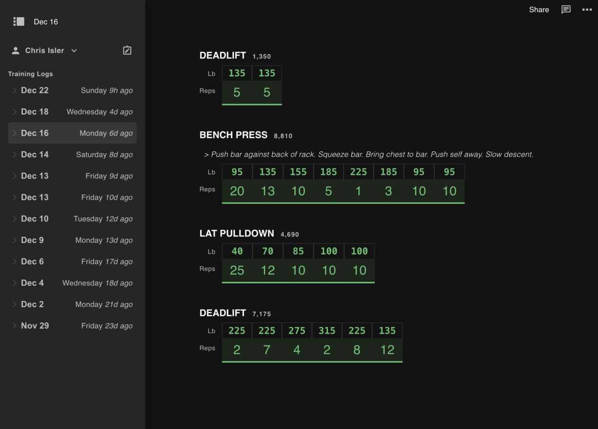

<!-- LOGO -->
<h1>

  
   Ghostty
</h1>
  

    Create workouts, share and make progress in the gym.
     
    <a href="#about">About</a>
    ·
    <a href="https://trainquil.vercel.app">Website</a>
  

## About

Trainquil is a training app that differentiates itself by being simple, fast, and powerful. While
there are many excellent training apps available, Trainquil provides a unique approach.

In all categories, I am not trying to claim that Trainquil is the best (i.e. the fastest, most
feature-rich, or most native). But Trainquil is competitive in all three categories and doesn't
make you choose between them.

Trainquil intends to push boundaries by exposing modern, opt-in features that enable lifters to get
more from time spent in the gym.

While aiming for this goal, our first step is to make Trainquil one of the best training apps for
intermediate lifters, remaining compatible with users at all levels while supporting the majority
of use cases in the ecosystem. You can use Trainquil as a drop-in replacement for your existing
training logs.

## Website

See the [website here.](https://trainquil.vercel.app)

## Roadmap and Status

The high-level ambitious plan for the project, not in order:

|  #  | Step                                                      | Status |
| :-: | --------------------------------------------------------- | :----: |
|  1  | Able to plan a workout, execute, and view it later        |   ✅   |
|  2  | Viable user interface design                              |   ✅   |
|  3  | Program templates -- users can train from an existing log |   ✅   |
|  4  | Rich history of a Movement, showing personal records      |   ⚠️   |
|  5  | Progression over time for a particular movement           |   ⚠️   |
|  6  | Comments, chat, social features                           |   ❌   |
|  7  | Private logs, subscription tier, live coaching            |   ❌   |
|  8  | Adjustable graph of movement weight/reps over time range  |   ❌   |
|  N  | Collaborative features, team workouts, etc.               |   ❌   |

## Screenshots

-
